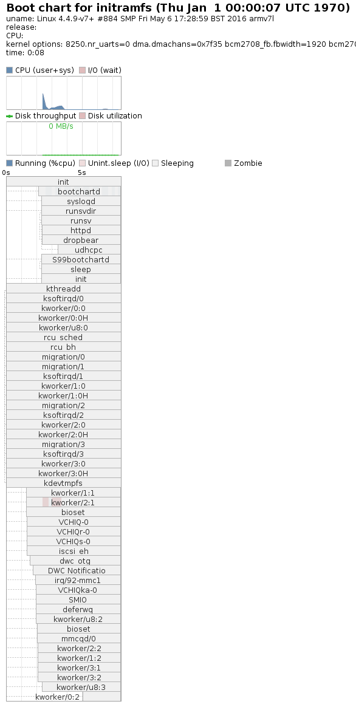

# A Simple Initramfs Builder For Raspbian
=========================================

## What is the intention of this project?

The basic idea is to develop a project using [Raspbian](https://raspbian.org/).
Once your application is complete, the system is transferred to a real embedded
Linux system running [busybox](https://busybox.net/) as it's core component.

## Why?

- much faster startup time
- SD card only mandatory for booting, not during operation
- almost no interference from "outside" your application

## What's the catch?

- building up an own initramfs needs deeper insight of a Linux system
- can (and most probably will) result in a longer phase of trial-and-error
  before getting the system up and running

## Is there a demo?

- the default configuration creates a minimal command-line Linux system

## Oh, does this mean it can be used to speed up the starting Raspbian as well?

Not in the form it is right now. If _might_ be possible to run the main boot
process from the initramfs and then switch to the root in the SD card
afterwards, but that is not one of the goals of this project.

## Does it work with other distros as well?

It mostly depends on the kernel configuration. Ubuntu-MATE was also tested
and it didn't work there.

# Installation
==============

## Creating an additional boot partition

- Shrink down the root filesystem by 64MB
  (I suggest using gparted on another system)
- In this free space, create a new FAT16 partition named INITRAMFS
- Copy the contents of /boot into this partition
- To config.txt, add the line:

``` initramfs initrd.gz 0xa00f00000 ```

- To command.txt, add add the end of the line (without starting a new one):

``` initrd=0xa00f00000 ```
  
  
To this partition the build script will copy the newly created initrd.gz.
You can boot from this partition by executing

```
echo <partitionnumber> >/sys/module/bcm2708/parameters/reboot_part #(Pi0, Pi1)
echo <partitionnumber> >/sys/module/bcm2709/parameters/reboot_part #(Pi2, Pi3)
reboot
```

(There also is script called "bootpart.sh" that does it for you.)

# Usage
=======

You build an essential initramfs by running the command:

```
./buildinitramfs.sh
```

Commandline arguments are addition data that should go into the initramfs.

- If the argument referres to a directory the contents of that directory
  will be added to the root of the initramfs
- If the argument referres to a file, it is expected that it specifies
  the files of directories that should be added, absolute paths

You can add either listfiles containing the files you want to add to your
initramfs, or 


# Bootchart
===========

Here is the output of the bootchart of a system running an http-server:
(build with ./buildinitramfs.sh httpd)



Note that the limiting factor is not starting the web server, but waiting for
the network interface to get started and running the dhcp client.
